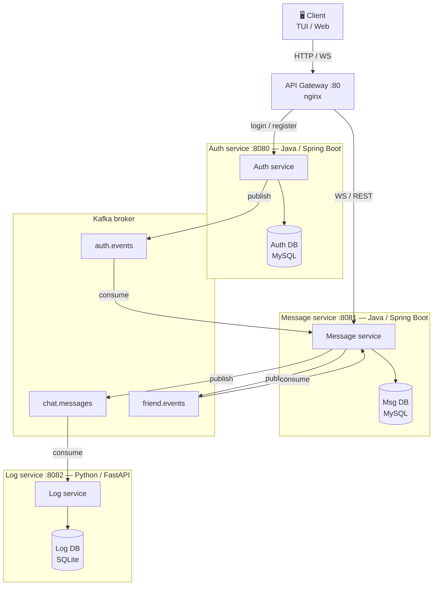

# websocmensagem

Aplicação de chat distribuída com mensagens em tempo real, construída como estudo de arquitetura de microsserviços, comunicação via WebSocket, event-driven design com Kafka e segurança com JWT.

---

## Arquitetura



### Serviços

| Serviço | Linguagem | Porta | Responsabilidade |
|---|---|---|---|
| API Gateway | nginx | 80 | Ponto de entrada único, roteamento |
| Auth service | Java / Spring Boot | 8080 | Login, registro, emissão de JWT |
| Message service | Java / Spring Boot | 8081 | WebSocket, mensagens, amizades, E2E encryption |
| Log service | Python / FastAPI | 8082 | Consome eventos Kafka e persiste histórico |
| TUI | Node.js / Blessed | — | Interface de terminal para o usuário |

### Tópicos Kafka

| Tópico | Producer | Consumer | Descrição |
|---|---|---|---|
| `auth.events` | Auth service | Message service | Publicado ao logar/registrar; Message service cacheia tokens localmente |
| `chat.messages` | Message service | Log service | Publicado a cada mensagem enviada |
| `friend.events` | Message service | Message service | Publicado ao aceitar amizade; atualiza lista em memória |

### Comunicação

- **Síncrona (REST/WS):** Client ↔ Gateway ↔ Auth service / Message service
- **Assíncrona (Kafka):** Auth service → Kafka → Message service / Log service

---

## Pré-requisitos

- [Docker](https://www.docker.com/) e Docker Compose
- [Node.js](https://nodejs.org/) 18+ (apenas para a TUI, que roda fora do Docker)
- [OpenSSL](https://www.openssl.org/) (para gerar as chaves JWT na primeira execução)

---

## Setup e execução

### 1. Clonar o repositório

```bash
git clone https://github.com/seu-usuario/websocmensagem.git
cd websocmensagem
```

### 2. Gerar as chaves JWT

As chaves RSA são necessárias para o Auth service assinar e verificar tokens.

```bash
# Chave privada
openssl genrsa -out auth-service/src/main/resources/app.key 2048

# Chave pública
openssl rsa -in auth-service/src/main/resources/app.key \
            -pubout -out auth-service/src/main/resources/app.pub

chmod 600 auth-service/src/main/resources/app.key
```

### 3. Subir todos os serviços

```bash
docker-compose up --build
```

Aguarde todos os serviços ficarem saudáveis. A ordem de inicialização é gerenciada pelo `depends_on` do Compose:

```
Zookeeper → Kafka → MySQL → Auth service → Message service → Log service → Gateway
```

### 4. Rodar a TUI

A TUI roda fora do Docker e se conecta ao Gateway na porta 80.

```bash
cd tui
npm install
node index.js
```

---

## Variáveis de ambiente

Todas as variáveis estão configuradas no `docker-compose.yml`. Para customizar, crie um arquivo `.env` na raiz:

```env
# MySQL
MYSQL_ROOT_PASSWORD=root
AUTH_DB_NAME=auth_db
MSG_DB_NAME=msg_db

# Kafka
KAFKA_BROKER=kafka:9092

# Portas internas (não alterar sem atualizar o nginx.conf)
AUTH_SERVICE_PORT=8080
MESSAGE_SERVICE_PORT=8081
LOG_SERVICE_PORT=8082
```

---

## Endpoints

### Auth service (`/` via Gateway)

| Método | Rota | Auth | Descrição |
|---|---|---|---|
| POST | `/register` | — | Cria novo usuário |
| POST | `/login` | — | Retorna access token + refresh token |
| POST | `/refresh` | — | Renova o access token |
| GET | `/users` | adm | Lista todos os usuários |
| GET | `/users/username/{username}` | ✓ | Busca usuário por username |
| PUT | `/edit-user/{id}` | ✓ | Edita username e senha |
| DELETE | `/delete-user/{id}` | ✓ | Remove usuário |

### Message service (`/` via Gateway)

| Método | Rota | Auth | Descrição |
|---|---|---|---|
| WS | `/ws-message` | JWT header | Conexão WebSocket (STOMP) |
| SEND | `/app/message` | ✓ | Envia mensagem direta |
| SUB | `/user/queue/messages` | ✓ | Recebe mensagens em tempo real |
| GET | `/messages/{userId}` | ✓ | Histórico paginado com um usuário |
| GET | `/users/friends/{id}` | ✓ | Lista amigos |
| POST | `/users/friends/sendrequest/{id}/{friendId}` | ✓ | Envia pedido de amizade |
| POST | `/users/friends/acceptrequest/{id}/{friendId}` | ✓ | Aceita pedido |
| POST | `/users/friends/rejectrequest/{id}/{friendId}` | ✓ | Rejeita pedido |
| POST | `/users/friends/cancelrequest/{id}/{friendId}` | ✓ | Cancela pedido enviado |
| POST | `/api/keys/keyregister` | ✓ | Registra chave pública RSA |
| GET | `/api/keys/keyget/{userId}` | ✓ | Obtém chave pública de um usuário |

### Log service (`/logs` via Gateway)

| Método | Rota | Auth | Descrição |
|---|---|---|---|
| GET | `/logs` | — | Lista todos os logs de mensagens |
| GET | `/logs/{userId}` | — | Logs de um usuário específico |

---

## Autenticação

O sistema usa **JWT RSA** com dois tipos de token:

- **Access token** — válido por 15 minutos, usado em todas as requisições autenticadas
- **Refresh token** — válido por 7 dias, usado exclusivamente em `POST /refresh`

Inclua o access token no header de todas as requisições protegidas:

```
Authorization: Bearer <access_token>
```

Para conexões WebSocket, inclua o token no header STOMP no momento do CONNECT:

```
Authorization: Bearer <access_token>
```

---

## Criptografia de mensagens (E2E)

O sistema suporta criptografia ponta a ponta opcional via RSA:

1. O cliente gera um par de chaves RSA localmente
2. Registra a chave pública via `POST /api/keys/keyregister`
3. Antes de enviar uma mensagem, busca a chave pública do destinatário via `GET /api/keys/keyget/{userId}`
4. Criptografa o conteúdo localmente antes de enviar
5. O servidor armazena e trafega apenas o conteúdo já criptografado

---

## Tolerância a falhas

- Se o **Log service** cair, o Kafka retém os eventos em `chat.messages` e os entrega quando o serviço voltar — o chat não é afetado
- Se o **Auth service** cair após o login, o Message service continua validando tokens do cache local alimentado por `auth.events`
- O API Gateway retorna `502 Bad Gateway` com mensagem clara se um serviço estiver indisponível

---

## Tecnologias

| Componente | Tecnologia |
|---|---|
| Auth service | Java 21, Spring Boot 4, Spring Security, Nimbus JWT |
| Message service | Java 21, Spring Boot 4, Spring WebSocket, STOMP, Spring Kafka |
| Log service | Python 3.12, FastAPI, confluent-kafka, SQLite |
| API Gateway | nginx |
| Message broker | Apache Kafka + Zookeeper |
| Bancos de dados | MySQL 8 (Auth DB, Msg DB), SQLite (Log DB) |
| TUI | Node.js 18, Blessed |
| Containerização | Docker, Docker Compose |
